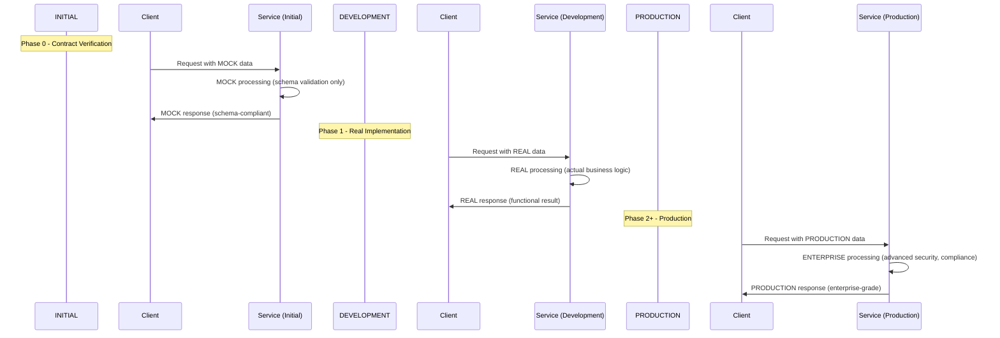

# ENVER-Based Service Context Pattern

## 🚀 **ULTIMATE ONDEMANDENV PLATFORM BEST PRACTICE**

This document defines the **ULTIMATE BEST PRACTICE** for organizing service contexts in the ONDEMANDENV platform using the **enver-based deployment architecture**.

## 🎯 **CORE PRINCIPLE: PHASES = ENVERS**

### **Revolutionary Insight:**
Different development phases are actually **DIFFERENT ENVERS** in the ONDEMANDENV platform:

- **Phase 0** (Contract Verification) = `mock` enver
- **Phase 1** (MVP Development) = `dev` enver  
- **Phase 2+** (Production) = `main` enver

This alignment creates **perfect phase-environment mapping** with appropriate infrastructure, security, and objectives for each stage.

## 🏗️ **ENVER-BASED SERVICE CONTEXT ARCHITECTURE**

### **1. Service Context Decomposition Structure:**

```
src/lib/repos/[service]/docs/
├── SERVICE_CONTEXT.md          # Navigation hub with enver mapping
├── SERVICE_OVERVIEW.md         # High-level architecture (enver-agnostic)
├── MOCK_ENVER_CONTEXT.md      # Phase 0: Contract verification
├── DEV_ENVER_CONTEXT.md       # Phase 1: MVP development
└── MAIN_ENVER_CONTEXT.md      # Phase 2+: Production deployment
```

### **2. Context Responsibility Matrix:**

| Context File | Purpose | Environment | Infrastructure | Business Logic |
|--------------|---------|-------------|----------------|----------------|
| **SERVICE_OVERVIEW.md** | Architecture overview | Enver-agnostic | Generic patterns | Domain concepts |
| **MOCK_ENVER_CONTEXT.md** | Contract verification | Isolated workspace | Minimal/mocked | NO real logic |
| **DEV_ENVER_CONTEXT.md** | MVP development | Development workspace | Development-grade | REAL logic |
| **MAIN_ENVER_CONTEXT.md** | Production ready | Production workspace | Enterprise-grade | Full features |

## 🎯 **PHASE-TO-ENVER MAPPING PATTERN**

### **Standard Enver Configuration:**
```typescript
// Universal pattern for all services
protected initializeEnvers(): void {
  this._envers = [
    // Development constellation - MVP and testing
    new OdmdEnver[Service](this, this.contracts.accounts.developmentWorkspace, 'region', 
      new SRC_Rev_REF('b', 'dev')),
    
    // Production constellation - Enterprise deployment
    new OdmdEnver[Service](this, this.contracts.accounts.productionWorkspace, 'region', 
      new SRC_Rev_REF('b', 'main')),
    
    // Contract verification constellation - Isolated testing
    new OdmdEnver[Service](this, this.contracts.accounts.isolatedWorkspace, 'region', 
      new SRC_Rev_REF('b', 'mock'))
  ];
}
```

### **Phase Status Management:**
| Phase | Enver | Workspace | Status Management                                  |
|-------|-------|-----------|----------------------------------------------------|
| **Phase 0A** | `mock` | Isolated workspace | ✅ DONE (automatically when contractsLib generated) |
| **Phase 0B** | `mock` | Isolated workspace | ⚠️ REQUIRES USER CONFIRMATION                      |
| **Phase 1A** | `dev` | Development workspace | ⚠️ REQUIRES USER CONFIRMATION                      |
| **Phase 1B** | `dev` | Development workspace | ⚠️ REQUIRES USER CONFIRMATION                      |
| **Phase 2+** | `main` | Production workspace | ⚠️ REQUIRES USER CONFIRMATION                      |

## 📋 **CONTEXT CONTENT PATTERNS**

### **SERVICE_CONTEXT.md (Navigation Hub):**
```markdown
# [Service] - Context Navigation

## 🚀 **ENVER-BASED SERVICE CONTEXT ARCHITECTURE**

### **🎯 [SERVICE_OVERVIEW.md](./SERVICE_OVERVIEW.md)**
**High-level service architecture and mission**

### **🧪 [MOCK_ENVER_CONTEXT.md](./MOCK_ENVER_CONTEXT.md)**
**Phase 0: Contract Verification** (Isolated workspace - `mock` enver)

### **🔧 [DEV_ENVER_CONTEXT.md](./DEV_ENVER_CONTEXT.md)**
**Phase 1: MVP Development** (Development workspace - `dev` enver)

### **🚀 [MAIN_ENVER_CONTEXT.md](./MAIN_ENVER_CONTEXT.md)**
**Phase 2+: Production Ready** (Production workspace - `main` enver)

## 🎯 **PHASE-TO-ENVER MAPPING**
[Include mapping table]
```

### **SERVICE_OVERVIEW.md (Architecture Overview):**
```markdown
# [Service] - Overview

## 🎯 Service Mission
[Service-specific mission and purpose]

## 🏗️ Service Architecture
[Domain boundaries and responsibilities]

## 🚀 **ENVER-BASED DEPLOYMENT ARCHITECTURE**
[Links to enver-specific contexts]

## 🔐 API Specification
[Enver-agnostic API documentation]

## 📊 Data Schema & Storage
[Generic data models and schemas]
```

### **MOCK_ENVER_CONTEXT.md (Phase 0):**
```markdown
# [Service] - Mock Enver Context

## 🎯 **Mock Enver Deployment** (Isolated workspace)
**Target**: Phase 0 - Contract Verification with Mock Data/Code using BDD Tests

## 🚀 **CRITICAL: Mock Enver Focus**
- ✅ Schema validation and mocked responses
- ✅ BDD integration and contract verification
- ❌ NO real business logic implementation

## 🏗️ **Mock Enver Infrastructure**
[Mock-specific CDK configuration]

## 📋 **Mock Enver Implementation Tasks**
[Phase 0A and 0B specific tasks]

## 🧪 **Mock Data Specification**
[Service-specific mock data from master set]

## 📦 Contract Artifact (HTTP and async)
Prefer a single `schema-url` that can point to:
- **OpenAPI 3.1** for HTTP endpoints (paths + component schemas), or
- **AsyncAPI 2.x** for messaging channels/messages, or
- **ODMD Bundle** that references both. Keep OpenAPI `servers[0].url` empty; consumers use platform base URL. Use `operationId` (OpenAPI) or `channels` (AsyncAPI) to generate typed helpers.
```

### **DEV_ENVER_CONTEXT.md (Phase 1):**
```markdown
# [Service] - Dev Enver Context

## 🎯 **Dev Enver Deployment** (Development workspace)
**Target**: Phase 1 - MVP with Real Business Logic

## 🚀 **CRITICAL: Dev Enver Focus**
- ✅ REAL business logic implementation
- ✅ Development testing and validation
- ❌ NO production traffic

## 🏗️ **Dev Enver Infrastructure**
[Development-grade CDK configuration]

## 📋 **Dev Enver Implementation Tasks**
[Phase 1A and 1B specific tasks]

## 🔐 **Real Business Logic Implementation**
[Service-specific real implementation]

## 📦 Contract Artifact (HTTP and async)
Continue using OpenAPI for HTTP and AsyncAPI for events as applicable (or an ODMD Bundle). Keep artifacts in sync with real behavior so downstream consumers/tests derive accurate routes and channel names.
```

### **MAIN_ENVER_CONTEXT.md (Phase 2+):**
```markdown
# [Service] - Main Enver Context

## 🎯 **Main Enver Deployment** (Production workspace)
**Target**: Phase 2+ - Production Ready & Advanced Features

## 🚀 **CRITICAL: Main Enver Focus**
- ✅ Production-grade security and monitoring
- ✅ Auto-scaling and high availability
- ✅ Real user traffic handling

## 🏗️ **Main Enver Infrastructure**
[Enterprise-grade CDK configuration]

## 📋 **Main Enver Implementation Tasks**
[Phase 2+ specific tasks]

## 🔐 **Production Security Implementation**
[Production-specific security features]

## 📦 Contract Artifact (HTTP and async)
Maintain production-stable OpenAPI (HTTP) and/or AsyncAPI (events) artifacts (or a bundle). Downstream verifiers and clients build from platform base URL + path templates and from channel names/bindings, ensuring zero drift across environments.
```

## 🔄 **CROSS-SERVICE INTEGRATION PATTERN**

### **Master Mock Data Consistency:**
```typescript
// All mock envers use the same master mock data
export const MASTER_MOCK_DATA = {
  // Core entities (consistent across ALL services)
  ROOT_IDENTITY_ID: "550e8400-e29b-41d4-a716-446655440001",
  USER_ID: "user_12345_system",
  
  // Service-specific extracts for each service
  [SERVICE]_MOCK_DATA: {
    // Service-specific mock data derived from master set
  }
};
```

### **Enver Cross-Wiring Pattern:**
```typescript
// Mock constellation wiring 
const getMock = <T extends {targetRevision: any}>(arr: T[]): T => 
  arr.find(e => e.targetRevision.value === 'mock')!;

const serviceMock = getMock(service.envers);
serviceMock.wireUpstream(upstreamMock.apiBaseUrl);

// Dev constellation wiring 
const getDev = <T extends {targetRevision: any}>(arr: T[]): T => 
  arr.find(e => e.targetRevision.value === 'dev')!;

const serviceDev = getDev(service.envers);
serviceDev.wireUpstream(upstreamDev.apiBaseUrl);

// Main constellation wiring 
const getMain = <T extends {targetRevision: any}>(arr: T[]): T => 
  arr.find(e => e.targetRevision.value === 'main')!;

const serviceMain = getMain(service.envers);
serviceMain.wireUpstream(upstreamMain.apiBaseUrl);
```

## 🚨 **CRITICAL PLATFORM RULES**

### **1. ENVER PROGRESSION RULE (HAPPY PATH):**
```
[INITIAL] -> [DEVELOPMENT] -> [PRODUCTION] (Happy Path Progression)
    ↑            ↑              ↑
    |            |              |
    |            |              └─ Can reference [DEVELOPMENT] and [INITIAL] (backward references)
    |            └─ Can reference [INITIAL] (backward references)  
    └─ Cannot reference [DEVELOPMENT] or [PRODUCTION] (no forward references)
```

- **[INITIAL] enver**: Foundation - establishes contracts, cannot reference future envers
- **[DEVELOPMENT] enver**: Building on [INITIAL] - can reference [INITIAL] for "transition from" context
- **[PRODUCTION] enver**: Building on [DEVELOPMENT] - can reference [DEVELOPMENT] and [INITIAL] for "building on" context
- **CRITICAL**: No forward references allowed ([INITIAL] cannot reference [DEVELOPMENT]/[PRODUCTION])

### **2. PHASE STATUS CONFIRMATION RULE:**
- **EXCEPTION**: Phase 0A is automatically ✅ DONE when service context is generated
- **RULE**: All other phases require ⚠️ USER CONFIRMATION before marking ✅ COMPLETE

### **3. ENVER ISOLATION AND INTERACTION RULE:**
- **Production Constellation (`main`):** Must be strictly isolated. Envers within this constellation can only be wired to other `main` envers.
- **Development Constellation (`dev`):** Designed for integration testing. By default, `dev` envers are wired to other `dev` envers. For specific, temporary testing scenarios, a `dev` enver may be configured to consume producers from a `mock` enver.
- **Mock Constellation (`mock`):** Designed for contract verification. By default, `mock` envers are wired to other `mock` envers to provide a stable, isolated baseline.

### **4. CONTEXT COMPLETENESS RULE:**
- Each enver context must be **COMPLETELY SELF-CONTAINED**.
- It must include all necessary information for a developer or agent to implement the service for that phase independently.
- Cross-service consistency is maintained through the master mock data set, which must be used for all testing and validation.

### **5. DOCUMENTATION DISTRIBUTION RULE:**
- All contexts distributed via contracts library (`src/lib/repos/[service]/docs/`)
- Versioned with contracts code for automatic synchronization
- Safe cross-referencing within distributed package

## 🎯 **ULTIMATE BENEFITS**

### **1. Perfect Phase-Environment Alignment:**
- Each phase maps to appropriate infrastructure and security level
- Clear separation between contract verification, development, and production
- Optimal resource utilization and cost management

### **2. Independent Development Streams:**
- Mock enver for isolated contract testing
- Dev enver for safe real implementation testing
- Main enver for enterprise-grade production deployment

### **3. ONDEMANDENV Platform Optimization:**
- Leverages platform's native enver-based deployment model
- Consistent with platform patterns across all services
- Maximum platform feature utilization

### **4. Scalable Architecture:**
- Pattern scales to any number of services
- Consistent structure across entire system
- Easy onboarding for new services

## 🔄 **DISTRIBUTED vs OBSOLETE SERVICE CONTEXTS**

### **AUTHORITATIVE: Contracts Library Distribution**

The **AUTHORITATIVE** service contexts are located in the contracts library:
```
@org/contracts-lib/src/lib/repos/[service]/docs/
├── SERVICE_CONTEXT.md          # Navigation hub - AUTHORITATIVE
├── SERVICE_OVERVIEW.md         # Architecture overview - AUTHORITATIVE  
├── MOCK_ENVER_CONTEXT.md      # Phase 0 context - AUTHORITATIVE
├── DEV_ENVER_CONTEXT.md       # Phase 1 context - AUTHORITATIVE
└── MAIN_ENVER_CONTEXT.md      # Phase 2+ context - AUTHORITATIVE
```

These contexts are:
- ✅ **Versioned with contracts library**
- ✅ **Automatically distributed to all services**
- ✅ **Single source of truth**
- ✅ **Safe cross-referencing within package**

## 🔧 **COMPREHENSIVE EXTRACTION/PROJECTION INSTRUCTIONS**

### **🚨 MANDATORY: PRE-GENERATION CONFIRMATION 🚨**
Before generating any context files, the generator (developer or LLM) **MUST** first perform the following actions and confirm their completion:

- [ ] **1. Read All Platform Patterns:** I have read and understood all documents in the `.odmd` directory.
- [ ] **2. Read All Implementation Details:** I have read and understood all documents in the `_impl` directory, including the master mock data set and system-specific requirements.
- [ ] **3. Read All Design Documents:** I have read and understood all detailed design documents and use cases in the `_impl/_design` directory.
- [ ] **4. Confirm Understanding:** I hereby confirm that I have a comprehensive understanding of the entire system architecture, including all service boundaries, data schemas, contracts, and use case flows, and I am prepared to generate a complete and accurate service context without information loss.

**Only after confirming these four points may the generation process begin.**

---

### **STEP 1: READ THROUGH PLATFORM AND DESIGN DOCS**

**MANDATORY READING ORDER:**
1. **Platform Patterns**: Read ALL `.odmd/` documents to understand generic patterns
2. **Implementation Details**: Read ALL `_impl/` documents for system-specific requirements
   - **CRITICAL**: `_impl/[SYSTEM]_ENVER_CONTEXT_GENERATION.md` contains system-specific use cases, service boundaries, mock data, and DNS patterns
3. **Design Documents**: Read ALL `_impl/_design/` documents for detailed specifications
4. **Contracts Library**: Examine `src/lib/` for service boundaries and interfaces

**CRITICAL UNDERSTANDING REQUIREMENTS:**
- **Service Boundaries**: Understand what each service OWNS vs NEVER handles.
- **Contract Interfaces**: Understand producer/consumer relationships between services.
- **Data Schemas**: Understand all data structures and validation requirements.
- **Use Case Flows**: 🚨 **CRITICAL**: Understand and preserve the complete end-to-end user journeys and system interactions. **NO USE CASES OR STEPS MAY BE DROPPED.**

**🚨 MANDATORY USER CONSULTATION RULE:**
- **CRITICAL**: Developer/LLM MUST ask user for information when design details are insufficient.
- **REQUIRED**: User must provide detailed design specifications for complete mock data generation.
- **VALIDATION**: User input design must be comprehensive enough to generate complete mock data set across ALL services and use cases.
- **CONFIRMATION**: User must confirm phase status for all phases except Phase 0A (which is automatically ✅ DONE).

### **STEP 2: CONFIRM UNIFIED MOCK DATA AND USE CASES**

**🚨 USE CASE DECOMPOSITION MANDATE: NO INFORMATION LOSS**
- **Every use case** and every step within that use case described in the source design documents (`_impl/_design/**/*.md`) **MUST** be fully represented in the generated context files for each relevant service.
- The generated context is the **source of truth** for implementation. If a use case is missing from the context, it will be missing from the implementation.
- The generator is responsible for ensuring a 1:1 mapping from the design's use cases to the context's use case flows.

**UNIFIED MOCK DATA REQUIREMENTS:**
```typescript
interface UnifiedMockDataValidation {
  cross_service_consistency: "All services use identical mock IDs and references";
  use_case_coverage: "Mock data supports ALL UC1-UC6 flows completely";
  schema_compliance: "All mock data validates against service schemas";
  relationship_integrity: "Mock relationships maintain privacy boundaries";
}
```

**USE CASE VALIDATION MATRIX:**
| Use Case | Mock Data Required | Cross-Service Dependencies | Privacy Boundaries |
|----------|-------------------|----------------------------|-------------------|
| **[USE_CASE_1]: [Primary Use Case]** | [Required mock data types] | [Service A] → [Service B] | [Privacy requirements] |
| **[USE_CASE_2]: [Secondary Use Case]** | [Mock data structures] | [Service B] → [Service C] | [Data protection needs] |
| **[USE_CASE_N]: [Additional Use Case]** | [Test data requirements] | [Service C] → [Service A] | [Compliance boundaries] |

**Note**: Specific use cases and service names are defined in implementation documentation (`_impl/` folder).

### **STEP 3: PROJECT/EXTRACT/GENERATE FOR EACH ENVER CONTEXT**

#### **3.1: [INITIAL] ENVER CONTEXT GENERATION**

**EXTRACTION SOURCES:**
- **Contract Definitions**: Extract API endpoints, schemas, and integration points
- **Mock Data Specifications**: Extract consistent mock data for BDD testing
- **Schema Validation**: Extract validation schemas and requirements
- **BDD Test Scenarios**: Extract test cases for contract verification

**PROJECTION REQUIREMENTS:**
```markdown
# [Service] - [Initial] Enver Context

## 🎯 **[Initial] Enver Deployment** (Part of Mock Constellation)
**Target**: Phase 0 - Contract Verification with Mock [Service] Operations
**Focus**: Contract verification with MOCKED responses and dual BDD testing

### **Phase 0A: Contract Surface Layer** ✅ DONE
- **Contract Definition**: [Specific contract producer/consumer relationships]
- **API Endpoint Structure**: Mock endpoints at [service-pattern]
- **Schema Definitions**: Validation schemas for [service-specific operations]
- **Service Integration**: Contract-based integration with [upstream services]

### **Phase 0B: BDD Contract Verification** 🟠 IN_PROGRESS ⚠️ REQUIRES USER CONFIRMATION
- **Schema Validation**: All [service] request/response schemas implemented
- **Mock Handler Implementation**: Schema-valid mocked [service] responses
- **Dual BDD Integration**: Both infrastructure and browser BDD testing
- **Contract Compliance**: Verify [service] API contracts without real [business logic]

[Include: DNS setup, infrastructure resources, mock operations, use cases, BDD testing, checkpoints]
```

#### **3.2: [DEVELOPMENT] ENVER CONTEXT GENERATION**

**EXTRACTION SOURCES:**
- **[INITIAL] Enver Context**: Reference for "transition from" mocked responses
- **Real Implementation Requirements**: Extract actual business logic requirements
- **Cross-Service Integration**: Extract real service communication patterns
- **Development Infrastructure**: Extract development-grade infrastructure requirements

**PROJECTION REQUIREMENTS:**
```markdown
# [Service] - [Development] Enver Context

## 🎯 **[Development] Enver Deployment** ([development_environment])
**Target**: Phase 1 - MVP (Essential) with Real [Service] Operations
**Building On**: Contract verification completed in [INITIAL] enver
**Transition**: From Phase 0 mocked responses to real [service] operations
**Focus**: Real [service operations] (replacing Phase 0 mocked responses)

### **Phase 1A: [Core Service Operations]** 🟡 PLANNED ⚠️ REQUIRES USER CONFIRMATION
- **Real [Primary Function]**: Actual [service-specific implementation]
- **[Key Integration]**: Real integration with [upstream services]
- **[Authentication Model]**: Real verification via [auth mechanism]
- **[Data Management]**: [Service-specific data handling]

[Include: Infrastructure, security, use cases, checkpoints - all referencing REAL operations]
```

#### **3.3: [PRODUCTION] ENVER CONTEXT GENERATION**

**EXTRACTION SOURCES:**
- **[DEVELOPMENT] Enver Context**: Reference for "building on" development implementation
- **[INITIAL] Enver Context**: Reference for original contract foundation
- **Enterprise Requirements**: Extract production-grade security and compliance
- **Global Scalability**: Extract multi-region and performance requirements

**PROJECTION REQUIREMENTS:**
```markdown
# [Service] - [Production] Enver Context

## 🎯 **[Production] Enver Deployment** ([production_environment])
**Target**: Phase 2+ - Production [Service] Management
**Building On**: MVP implementation completed in [DEVELOPMENT] enver and contract validation from [INITIAL] enver
**Transition**: From development-grade to enterprise production-grade [service] management
**Focus**: Enterprise-grade [service operations] with advanced [service-specific features]

### **Phase 2A: Production [Service] Security** 🟡 PLANNED ⚠️ REQUIRES USER CONFIRMATION
- **Enterprise [Primary Function]**: Advanced security integration for [service operations]
- **Advanced [Service Features]**: [Enterprise-specific capabilities]
- **Global [Service Distribution]**: Multi-region [service] management
- **Compliance**: Enterprise [service] compliance requirements

[Include: Enterprise infrastructure, advanced security, global scalability, compliance]
```

### **STEP 4: MAINTAIN CONTRACTS BOUNDARY/INTERFACE/DEPENDENCY INTEGRITY**

#### **4.1: CONTRACT BOUNDARY PRESERVATION**

**BOUNDARY VALIDATION CHECKLIST:**
- [ ] **Service OWNS**: Every enver context clearly defines what the service owns
- [ ] **Service NEVER Handles**: Every enver context explicitly lists forbidden operations
- [ ] **Producer/Consumer**: Contract relationships maintained across all envers
- [ ] **API Surface**: Endpoint contracts consistent across [INITIAL] → [DEVELOPMENT] → [PRODUCTION]

#### **4.2: DATA SCHEMA CONSISTENCY**

**SCHEMA VALIDATION REQUIREMENTS:**
```typescript
interface SchemaConsistencyValidation {
  zod_schemas: "Identical schemas across all envers with implementation differences";
  mock_data_compliance: "Mock data validates against real schemas";
  cross_service_types: "Shared types consistent across service boundaries";
  version_compatibility: "Schema evolution maintained across enver progression";
}
```

#### **4.3: WORKFLOW PRESERVATION IN MMD FILES**

**MERMAID DIAGRAM REQUIREMENTS:**
- **[INITIAL] enver**: Workflows show MOCKED service interactions
- **[DEVELOPMENT] enver**: Workflows show REAL service interactions (same flow, real implementation)
- **[PRODUCTION] enver**: Workflows show ENTERPRISE service interactions (same flow, enterprise security)

**WORKFLOW EVOLUTION PATTERN:**


### **CRITICAL SUCCESS CRITERIA**

#### **INFORMATION PRESERVATION VALIDATION:**
- [ ] **No Information Loss**: Every detail from design docs preserved in appropriate enver context
- [ ] **Contract Integrity**: Service boundaries maintained across all envers
- [ ] **Cross-Service Consistency**: Mock data and interfaces align across all services
- [ ] **Progressive Enhancement**: Each enver builds appropriately on previous envers
- [ ] **Self-Containment**: Each context provides complete guidance for its enver

#### **DEVELOPER/LLM GENERATION VALIDATION:**
- [ ] **Comprehensive Source Reading**: All platform, impl, and design docs thoroughly analyzed
- [ ] **User Consultation Completed**: Asked user for missing information and received comprehensive design details
- [ ] **User Design Validation**: User-provided design is sufficient for complete mock data generation across all services
- [ ] **Unified Mock Data**: Consistent mock data validated across all services and use cases
- [ ] **Systematic Extraction**: Information systematically projected from sources to contexts
- [ ] **Contract Boundary Respect**: Service contracts and boundaries strictly maintained
- [ ] **Workflow Integrity**: Data flows and business logic preserved across enver progression
- [ ] **Phase Status Confirmation**: User confirmed all phase statuses except Phase 0A (auto-complete)

This **ENVER-BASED SERVICE CONTEXT PATTERN** with comprehensive extraction/projection instructions represents the ultimate best practice for organizing service development on the ONDEMANDENV platform, ensuring perfect alignment between development phases and deployment environments while maintaining complete information integrity and contract compliance.

## 🔖 **STANDARDIZED SERVICE CONTEXT GENERATION TEMPLATE**

This section provides the official template to be used for generating the five service context documents. The generator (developer or LLM) MUST populate all sections based on the comprehensive extraction from the system's design documentation.

---

### **Template for: `SERVICE_CONTEXT.md`**

```markdown
# [Service Name] - Context Navigation

## 🚀 ENVER-BASED SERVICE CONTEXT ARCHITECTURE

This directory contains the complete, self-contained development context for the **[Service Name]**, decomposed by deployment enver. Each document provides the necessary information for its corresponding development phase.

### **🎯 [SERVICE_OVERVIEW.md](./SERVICE_OVERVIEW.md)**
**High-level service architecture, mission, and enver-agnostic design.**

### **🧪 [MOCK_ENVER_CONTEXT.md](./MOCK_ENVER_CONTEXT.md)**
**Phase 0: Contract Verification** (Isolated `mock` enver) - Focus on schema validation and mocked responses with BDD.

### **🔧 [DEV_ENVER_CONTEXT.md](./DEV_ENVER_CONTEXT.md)**
**Phase 1: MVP Development** (Development `dev` enver) - Focus on implementing real business logic.

### **🚀 [MAIN_ENVER_CONTEXT.md](./MAIN_ENVER_CONTEXT.md)**
**Phase 2+: Production Ready** (Production `main` enver) - Focus on enterprise-grade features, security, and scale.

## 🗺️ PHASE-TO-ENVER MAPPING

| Phase | Enver | Workspace | Status Management |
|---|---|---|---|
| **Phase 0A** | `mock` | Isolated | ✅ DONE (auto-completed on generation) |
| **Phase 0B** | `mock` | Isolated | ⚠️ REQUIRES USER CONFIRMATION |
| **Phase 1A** | `dev` | Development | ⚠️ REQUIRES USER CONFIRMATION |
| **Phase 1B** | `dev` | Development | ⚠️ REQUIRES USER CONFIRMATION |
| **Phase 2+** | `main` | Production | ⚠️ REQUIRES USER CONFIRMATION |

```

---

### **Template for: `SERVICE_OVERVIEW.md`**

```markdown
# [Service Name] - Overview

## 🎯 Service Mission

[A 1-2 paragraph summary of the service's purpose and its role in the overall system. What is its primary goal? What core philosophies from the system design does it embody?]

- **Core Philosophy**: "[A key design principle this service is responsible for.]"
- **Repository**: `[service-repo-name]`
- **Build ID**: `OdmdBuild[ServiceName]Kk`

## 🏗️ Service Architecture

[A high-level description of the service's internal components and domain boundaries. Use a Mermaid diagram if it aids clarity.]

### Components
- **[Component 1]**: [Description of the component, e.g., AWS::ApiGatewayV2::Api]
- **[Component 2]**: [Description of the component, e.g., AWS::Lambda::Function]
- **[Component 3]**: [Description of the component, e.g., AWS::S3::Bucket]
- **Event/Stream Processing**: [High-level summary of how the service interacts with SQS, EventBridge, Kinesis, etc.]

### Storage Schema (`[SchemaName]`)
[A JSON block describing the data structure for this service's primary data store (e.g., an S3 object).]
```json
{
  "primary_key": "string",
  "attribute_1": "string",
  "attribute_2": "number"
}
```

## 🔐 API Specification (Enver-Agnostic)

[List the main API endpoints and their purpose. Detailed request/response schemas will be in the enver-specific contexts.]

- **`[METHOD] /[resource]`**: [Brief description of the endpoint's function.]
- **`[METHOD] /[resource]`**: [Brief description of the endpoint's function.]

## 🔗 Contracts & Dependencies
- **Upstream Dependencies**:
    - `[Upstream Service 1]`: [Reason for dependency]
- **Downstream Consumers**:
    - `[Downstream Service 1]`: [Reason for dependency]
    - `Web Client`

## 🚀 ENVER-BASED DEPLOYMENT ARCHITECTURE

This service follows the ONDEMANDENV platform's enver-based deployment model. For detailed implementation and phase-specific information, see the context documents:

- **[MOCK_ENVER_CONTEXT.md](./MOCK_ENVER_CONTEXT.md)** (Phase 0)
- **[DEV_ENVER_CONTEXT.md](./DEV_ENVER_CONTEXT.md)** (Phase 1)
- **[MAIN_ENVER_CONTEXT.md](./MAIN_ENVER_CONTEXT.md)** (Phase 2+)
```

---

### **Template for: `MOCK_ENVER_CONTEXT.md`**

```markdown
# [Service Name] - Mock Enver Context

## 🎯 Mock Enver Deployment (Isolated Workspace)
**Target**: Phase 0 - Contract Verification with Mock Data/Code using BDD Tests
**Focus**: Contract verification with MOCKED responses and dual BDD testing. **NO REAL BUSINESS LOGIC.**

## 📋 Mock Enver Implementation Tasks

### Phase 0A: Contract Surface Layer ✅ DONE
- **CDK Stack Setup**: Basic service stack with HTTP API + Lambda.
- **Contract Integration**: `OdmdShareOut` publishing the service's base URL, consuming upstream services.
- **Basic Endpoints**: Core API endpoints returning MOCKED, schema-compliant responses only.
- **Storage Layer**: S3/DynamoDB with SSE-KMS for schemas and mock data only.
- **Event Integration**: SQS queues for mocked event publishing.

### Phase 0B: BDD Contract Verification 🟠 IN_PROGRESS ⚠️ REQUIRES USER CONFIRMATION
- **Zod Schemas**: Complete request/response schemas in `lib/handlers/src/schemas/zod.ts`.
- **Schema Deployment**: `deploySchema()` implementation with S3 artifact publishing.
- **Schema Consumption**: Upstream schema downloads via `json-schema-to-zod`.
- **Mocked Handlers**: Lambda handlers returning schema-valid MOCKED responses using the data below.
- **BDD Test Integration**: Perfect alignment with web-client dual BDD (Step Functions + Playwright).

## 🧪 Mock Data & Use Case Flows

[This section details every use case the service participates in for the MOCK enver, with a specific focus on the MOCKED data contracts for each step.]

### Use Case: [Use Case Name]

#### [Step Name]
- **Source Design Reference**: `_impl/_design/1/docs/a2_prompt_6cases.md, UC-2`
- **Flow**: `[Source] → [This Service]`
- **Action**: [A brief description of what happens in this step.]
- **Upstream Dependencies & Contracts (Mocked)**:
  - **Service**: `[Upstream Service Name]`
  - **Interaction**: `[API Call | Event Consumed | Stream Read]`
  - **Endpoint/Topic**: `[METHOD] /[resource] | [SQS Queue Name]`
  - **Expected Schema (Mock Response from Upstream)**:
    ```json
    { "field_from_upstream": "mock_value" }
    ```
- **Endpoint**: `[METHOD] /[resource]`
- **API Request Schema (Mock)**:
  ```json
  { "request_field_1": "string", "request_field_2": "integer" }
  ```
- **API Response (Mock)**:
  ```json
  { "mock_response_field_1": "[Example Value from Master Mock Data Set]" }
  ```
- **Storage Action**: None. (Phase 0 does not persist real data).
- **Event Emission (Mock)**: [Optional: Describe the mocked event emitted, e.g., "Emits a mocked `ThingDone` event to an SQS queue with a schema-compliant payload."]
- **Stream Record (Mock)**: [Optional: Describe the mocked record written to a Kinesis stream.]

- **Mermaid Flowchart**:
  ```mermaid
  flowchart LR
      %% This graph must visually represent the data flow for this specific use case step.
      %% It must be consistent with the endpoint, schemas, and data actions described above.

      Client([Client]) -->|`[METHOD] /[resource]`
Request: `mock_request_payload`|Service([Service Name])
      Service -->|Emits Mock Event|SQS([SQS Queue])
      Service -->|Mock Response: `mock_response_payload`|Client
  ```

## ✅ Checkpoint Validation
- **List Constellations**: `npm run Odmd[ServiceName]:cdk:ls --silent`
- **Verify Mock Endpoint**: `curl -X [METHOD] https://<service>-api-mock.amazonaws.com/[resource] -d '{...}'`
- **Run BDD Tests**: `cd services/web-client/vite && npm run test:bdd`
```

---

### **Template for: `DEV_ENVER_CONTEXT.md`**

```markdown
# [Service Name] - Dev Enver Context

## 🎯 Dev Enver Deployment (Development Workspace)
**Target**: Phase 1 - MVP with Real Business Logic
**Building On**: Contract verification completed in `mock` enver.
**Transition**: From Phase 0 mocked responses to real service operations.
**Focus**: Implementing REAL business logic, replacing all mocked handlers.

## 📋 Dev Enver Implementation Tasks

### Phase 1A: Core Domain Logic 🟡 PLANNED ⚠️ REQUIRES USER CONFIRMATION
- **Domain Operations**: Complete implementation of service-specific operations.
- **Cross-Service Integration**: Real integration with upstream/downstream services.
- **Data Storage**: Actual data persistence and retrieval.
- **Event Publishing**: Real event publishing for state changes.
- **Error Handling**: Comprehensive error responses and recovery mechanisms.

### Phase 1B: Advanced MVP Features 🟡 PLANNED ⚠️ REQUIRES USER CONFIRMATION
- **Authentication/Authorization**: Real security implementation.
- **Performance Optimization**: Efficient data access and processing.
- **Monitoring Integration**: CloudWatch metrics and logging.
- **Security Hardening**: Data protection and secure communication.

## ⚙️ Real Business Logic & Use Case Flows

[This section details every use case the service participates in for the DEV enver, with a focus on the REAL data contracts and logic.]

### Use Case: [Use Case Name]

#### [Step Name]
- **Source Design Reference**: `_impl/_design/1/docs/a2_prompt_6cases.md, UC-2`
- **Flow**: `[Source] → [This Service]`
- **Action**: [A description of the REAL business logic.]
- **Upstream Dependencies & Contracts (Real)**:
  - **Service**: `[Upstream Service Name]`
  - **Interaction**: `[API Call | Event Consumed | Stream Read]`
  - **Endpoint/Topic**: `[METHOD] /[resource] | [SQS Queue Name]`
  - **Consumed Schema (from Upstream Service)**:
    ```json
    { "field_from_upstream": "string" }
    ```
- **Endpoint**: `[METHOD] /[resource]`
- **API Request Schema**:
  ```json
  { "request_field_1": "string", "request_field_2": "integer" }
  ```
- **API Response Schema**:
  ```json
  { "response_field_1": "string" }
  ```
- **Storage Action**: [Description of the Create, Read, Update, or Delete operation on the real storage schema.]
- **Event Emission**: [Optional: Describe the real event emitted to an SQS queue or EventBridge bus.]
- **Stream Record**: [Optional: Describe the real record written to a Kinesis stream, including its schema.]

- **Mermaid Flowchart**:
  ```mermaid
  flowchart LR
      %% This graph must visually represent the data flow for this specific use case step.
      %% It must be consistent with the endpoint, schemas, and data actions described above.

      Client([Client]) -->|`[METHOD] /[resource]`|Service([Service Name])
      Service -->|Writes to `[SchemaName]`|S3([S3 Bucket])
      Service -->|Publishes `ThingDone` Event|EventBridge([EventBridge Bus])
      Service -->|Response|Client
  ```

## ✅ Checkpoint Validation
- **Verify Real Endpoint**: `curl -X [METHOD] https://<service>-api-dev.amazonaws.com/[resource] -H "Authorization: Bearer <real-token>" -d '{...}'`
- **Verify Event Publishing**: `aws sqs receive-message --queue-url <service-event-queue-url>`
```

---

### **Template for: `MAIN_ENVER_CONTEXT.md`**

```markdown
# [Service Name] - Main Enver Context

## 🎯 Main Enver Deployment (Production Workspace)
**Target**: Phase 2+ - Production Ready & Advanced Features
**Building On**: MVP implementation completed in `dev` enver.
**Transition**: From development-grade to enterprise production-grade management.
**Focus**: Enterprise-grade security, scalability, monitoring, and advanced features.

## 📋 Main Enver Implementation Tasks

### Phase 2A: Production Security & Hardening 🟡 PLANNED ⚠️ REQUIRES USER CONFIRMATION
- **Enterprise Security**: Advanced security integration (e.g., WAF, fine-grained IAM).
- **Global Scalability**: Multi-region deployment, auto-scaling, and performance tuning.
- **Compliance**: Implementing enterprise compliance and auditing requirements.
- **Advanced Monitoring**: Detailed dashboards, alarms, and observability.

### Phase 2B: Advanced Features 🟡 PLANNED ⚠️ REQUIRES USER CONFIRMATION
- **[Advanced Feature 1]**: [Description of enterprise-grade feature.]
- **[Advanced Feature 2]**: [Description of enterprise-grade feature.]

## ⚙️ Enterprise-Grade Logic & Use Case Flows

[This section details any modifications or enhancements to the use cases for the PRODUCTION enver.]

### Use Case: [Use Case Name]

#### [Step Name]
- **Enhancements**: [Description of any production-specific logic, such as enhanced security checks, global replication, advanced analytics, or high-throughput event processing.]

## ✅ Checkpoint Validation
- **Performance Baseline**: [Service-specific metrics and SLOs].
- **Security Audit**: [Results of automated security scans and manual review].
- **Load Testing**: [Results of load tests against production-like environment].
```
""
