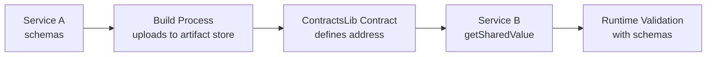

# Platform Schema Architecture Best Practices

> **Cross-Reference**: This document details schema implementation. See `ONDEMANDENV_PLATFORM.md` for general platform concepts and service patterns.

## 📋 Overview

The ondemandenv.dev platform implements a **two-layer schema architecture** that separates stable contract boundaries from evolving data structures, enabling autonomous service development while maintaining type safety across distributed systems.

## Reference implementation notes (general)

- **Contract Surface wiring pattern**
  - Define producers and consumers in your organization’s ContractsLib using `OdmdCrossRefProducer`/`OdmdCrossRefConsumer` on each `Enver` type.
  - In each service CDK stack, publish concrete addresses (for example, an API Gateway base URL) via `OdmdShareOut`.
  - Services consume upstream contract values at synth time using the consumer’s `getSharedValue(stack)` method. This replaces placeholders and enables service discovery without hard-coding.

- **Typical service relationships**
  - A downstream service declares consumers for upstream producers (for example, `ServiceB` consumes `ServiceA`).
  - At the end of stack construction, each service publishes its own producer(s) (for example, base URLs, schema artifact addresses, event buses) with `OdmdShareOut`.
  - Use whatever infrastructure endpoint is authoritative in your design (for example, `HttpApi.apiEndpoint`), rather than inventing placeholder domains.

- **ContractsLib best practices**
  - Wire cross-build relationships at the ContractsLib layer (for example, `wireX(...)` methods) once all builds and leurs `Enver`s are initialized.
  - Keep build constructors side-effect-free; do not perform cross-build consumption during construction. Let the ContractsLib initialize all `Enver`s, then wire dependencies.
  - Avoid self-consumption within the same build. Producers should be consumed by other builds only.

- **CDK app pattern**
  - Each service CDK app initializes the organization ContractsLib, selects the target `Enver` (for example, based on branch/tag), and derives stable stack IDs via `getRevStackNames()`.
  - Read AWS account/region from the CDK environment (`CDK_DEFAULT_ACCOUNT`, `CDK_DEFAULT_REGION`) and pass them into stacks via `env`.
  - For local iteration, use any appropriate AWS CLI profile with valid credentials (for example, `--profile <your-profile>`) when running `cdk ls/deploy`.

- **Next steps for adopters**
  - Implement real handlers with validation and observability; publish any additional contract surfaces (events, queues, schemas) via `OdmdShareOut`.
  - Add the schema workflow: producers call `deploySchema` during build/deploy; consumers generate types with `SchemaTypeGenerator` and use `getSharedValue(...)` at runtime to resolve schema addresses.
  - Support multiple constellations (for example, dev/main/mock) by defining appropriate `Enver`s and wiring in the ContractsLib; validate enver selection end-to-end.
  - Add minimal tests and CI to enforce `cdk ls`/synth hygiene and contract invariants.

## 🏗️ **Dual-Layer Model**

### **Contract Surface Layer (formerly Layer 1)**
- Define **stable service boundaries** and API addresses
- Specify **schema contract addresses** (where schemas live)
- Rarely change - provides system stability
- Handle service discovery and dependency wiring

### **Implementation Schema Layer (formerly Layer 2)**
- Contain **detailed request/response schemas** in service-specific directories
- Use **schema validation libraries** for validation and type generation
- **Frequently evolve** independently within service boundaries
- Co-located with service code for autonomous development

### **Schema Sharing Flow**


### **Example Flow: Service A → Service B**
1. **Contract Definition** (ContractsLib): Schema address defined
2. **Schema Implementation** (Service A): Concrete schema with validation library
3. **Schema Upload** (Build Process): Uploads schema artifacts during deployment
4. **Schema Consumption** (Service B): Fetches via `getSharedValue(contractAddress)`
5. **Runtime Validation**: Validates requests against fetched schema

## 📡 **Event-Driven Schema Contracts**

### **Event Schema Pattern**
Services produce events with schema contracts:

```typescript
// Infrastructure endpoint
serviceEvents.eventBridge

// Schema contracts
serviceEvents.eventProcessedSchema     // Successful processing
serviceEvents.eventFailedSchema        // Failed processing  
serviceEvents.eventMetricsSchema       // Performance metrics
```

### **Stream Schema Pattern**
Services produce stream records with schema contracts:

```typescript
// Stream records
serviceStreams.mainRecordSchema         // Main processing records
serviceStreams.priorityRecordSchema     // Priority processing records
serviceStreams.batchJobRecordSchema     // Batch job records
serviceStreams.failedRecordSchema       // Failed processing records
```

## 🔌 **API Gateway Schema Contracts**

### **Request/Response Schema Pattern**
Services provide APIs with request/response schemas:

```typescript
serviceApi.requestSchema    // Request structure
serviceApi.responseSchema   // Response structure
serviceApi.metadataSchema   // Filters/metadata
```

## 🔄 **Service Implementation Pattern**

### **1. Schema Definition with Validation Library**
Each service defines concrete schemas using validation libraries for type safety:

```typescript
// In individual service: schemas/request.schema.ts
import { z } from 'zod'; // Example using Zod

export const RequestSchema = z.object({
  query: z.object({
    text: z.string().min(1),
    parameters: z.record(z.unknown()).optional()
  }),
  filters: z.object({
    categories: z.array(z.string()).optional(),
    date_range: z.object({
      start: z.string().datetime(),
      end: z.string().datetime()
    }).optional()
  }).optional(),
  options: z.object({
    limit: z.number().int().positive().max(100).default(10),
    include_metadata: z.boolean().default(true)
  })
});

// Export TypeScript types
export type Request = z.infer<typeof RequestSchema>;
```

### **2. Schema Deployment via Build Process**
Schemas are automatically deployed as artifacts during CDK deployment using the platform's `deploySchema` utility:

```typescript
// In service CDK stack
import { deploySchema } from '@org/contracts-lib/lib/utils/schema-deployment';
import { execSync } from 'node:child_process';

export class ServiceStack extends Stack {
  async render() {
    // Generate JSON Schema from Zod schema via script
    const schemaStr = execSync('ts-node scripts/schema-print.ts', {
      cwd: __dirname + '/handlers',
      stdio: ['ignore', 'pipe', 'inherit']
    }).toString();

    // Deploy schema to S3 artifact store with git versioning
    const schemaUrl = await deploySchema(this, schemaStr, this.enver.apiBaseUrl.children![0]);
    
    // Publish both base URL and schema URL via OdmdShareOut
    new OdmdShareOut(this, new Map([
      [this.enver.apiBaseUrl, httpApi.apiEndpoint],
      [this.enver.apiBaseUrl.children![0], schemaUrl]
    ]));
  }
}
```

### **3. Runtime Validation with Schema Libraries**
Services validate data using schema libraries:

```typescript
// In service handler
import { RequestSchema, type Request } from './schemas/request.schema';

export const handler = async (event: APIGatewayProxyEvent) => {
  try {
    // Parse and validate request body
    const requestBody = JSON.parse(event.body || '{}');
    const validatedRequest: Request = RequestSchema.parse(requestBody);
    
    // Process validated request
    const results = await processRequest(validatedRequest);
    
    return {
      statusCode: 200,
      body: JSON.stringify(results)
    };
  } catch (error) {
    if (error instanceof z.ZodError) {
      return {
        statusCode: 400,
        body: JSON.stringify({
          error: 'Invalid request format',
          details: error.errors
        })
      };
    }
    throw error;
  }
};
```

## 🔍 **Consumer Schema Access**

Consumer services fetch and use schemas via contract addresses:

```typescript
// In consuming service
import { getSharedValue } from '@platform/contracts-lib-base';
import { OrgContracts } from '@org/contracts-lib';

export class ConsumerService {
  private requestSchema: SchemaType;
  
  async initialize() {
    const contracts = OrgContracts.inst;
    const schemaAddress = contracts.serviceBuild.dev.serviceApi.requestSchema;
    
    // Fetch schema from artifact store via contract address
    this.requestSchema = await getSharedValue(schemaAddress);
  }
  
  async makeRequest(data: unknown) {
    // Use fetched schema to validate outgoing requests
    const validatedRequest = this.requestSchema.parse(data);
    
    // Make validated API call to other service
    const response = await this.httpClient.post('/api/endpoint', validatedRequest);
    return response;
  }
}
```

## 📊 **Benefits**

### **1. Autonomous Development**
- **Service Independence**: Each service controls its own schema evolution
- **Contract Stability**: Service boundaries don't change when schemas evolve
- **Parallel Development**: Teams can work on different services simultaneously

### **2. Type Safety**
- **Compile-time checks** with TypeScript interfaces from schema libraries
- **Runtime validation** with schema parsing
- **IDE autocompletion** and error detection

### **3. Platform Integration**
- **Automatic Versioning**: Platform handles schema versioning during deployment
- **Contract Discovery**: Services discover each other via contract addresses
- **Artifact Management**: Build process handles schema upload and distribution

### **4. Development Experience**
- **Co-located Schemas**: All schemas within service context
- **Reduced Cognitive Load**: Development focused on single service + contracts
- **Clear Boundaries**: Well-defined scope and responsibility per service

## 🚀 **Implementation Workflow**

### **Phase 1: Contract Definition**
- Schema contract addresses defined in ContractsLib
- Service boundaries and dependencies wired
- Contract consumers and producers established

### **Phase 2: Service Implementation**
1. **Create service directories** with appropriate build structure
2. **Implement schemas** using validation libraries in service-specific directories
3. **Add build schema deployment** in service build processes
4. **Build service handlers** with schema validation
5. **Test contract compliance** via getSharedValue()

### **Phase 3: Build and Deployment Process**
1. **`.scripts/build.sh`** calls `bin/gen-schemas.ts` to download upstream schemas
2. **`SchemaTypeLoader`** downloads JSON schemas from S3 to `lib/handlers/src/__generated__/`
3. **`json-schema-to-zod`** converts JSON schemas to TypeScript Zod types inline
4. **Service compilation** builds handlers with generated types (Zod in runtime scope)
5. **CDK deployment** via `bin/cdk.ts` creates stack and calls `await appStack.render()`
6. **Stack `render()`** calls `scripts/schema-print.ts` to convert Zod → JSON Schema
7. **`deploySchema()`** uploads JSON Schema to S3 with git versioning
8. **Platform publishes** schema URLs via `OdmdShareOut` for downstream consumption

## 🛠️ **Platform-Provided Schema Utilities**

### **Schema Deployment Utility (`deploySchema`)**
Platform provides automated schema deployment function:

```typescript
import { deploySchema } from '@org/contracts-lib/lib/utils/schema-deployment';

export async function deploySchema<T extends AnyOdmdEnVer>(
    scope: cdk.Stack,
    schemaStr: string,  // JSON Schema string (not Zod object)
    urlPrd: OdmdCrossRefProducer<T>
): Promise<string>
```

**Features:**
- **Git Integration**: Automatically tags schemas with git SHA for versioning
- **S3 Deployment**: Uploads JSON schemas to versioned S3 artifacts  
- **SSM Integration**: Resolves artifact bucket names from SSM parameters
- **CDK Integration**: Seamless integration with AWS CDK deployment process
- **Version Tracking**: Creates unique S3 object versions with git metadata

**Usage in Service CDK Stack:**
```typescript
import { deploySchema } from '@org/contracts-lib/lib/utils/schema-deployment';
import { execSync } from 'node:child_process';

export class MyServiceStack extends Stack {
  readonly enver: MyEnverType;

  constructor(scope: Construct, id: string, props: MyStackProps) {
    super(scope, id, props);
    this.enver = props.enver;

    // Infrastructure setup in constructor
    const httpApi = new apigwv2.HttpApi(this, 'MyHttpApi');
    // ... other infrastructure

    // Publish contract surface
    new OdmdShareOut(this, new Map([
      [this.enver.myServiceApiBaseUrl, httpApi.apiEndpoint]
    ]));
  }

  async render() {
    // Generate JSON Schema from Zod via script
    const schemaStr = execSync('ts-node scripts/schema-print.ts', {
      cwd: __dirname + '/handlers',
      stdio: ['ignore', 'pipe', 'inherit']
    }).toString();

    // Deploy schema using platform utility
    await deploySchema(this, schemaStr, this.enver.myServiceApiBaseUrl.children![0]);
  }
}
```

**CDK App Pattern (`bin/cdk.ts`):**
```typescript
#!/usr/bin/env node
import 'source-map-support/register';
import * as cdk from 'aws-cdk-lib';
import { StackProps } from 'aws-cdk-lib';
import { MyServiceStack } from '../lib/my-service-stack';
import { MyOrgContracts, type MyOrgEnver } from '@my-org/contracts-lib';

const app = new cdk.App();

async function main() {
  const account = process.env.CDK_DEFAULT_ACCOUNT;
  const region = process.env.CDK_DEFAULT_REGION;
  if (!account || !region) {
    throw new Error('Missing CDK_DEFAULT_ACCOUNT or CDK_DEFAULT_REGION');
  }

  const props: StackProps = { env: { account, region } };

  new MyOrgContracts(app);
  const enver = MyOrgContracts.inst.getTargetEnver() as MyOrgEnver;
  const [stackName] = enver.getRevStackNames();

  const appStack = new MyServiceStack(app, stackName, { ...props, enver });
  await appStack.render(); // Critical: Must call render() to deploy schemas
}

main().catch((e) => {
  console.error(e);
  throw e;
});
```

### **Service Handler Structure**
Each service must have a complete handler package with proper configuration:

```
services/my-service/lib/handlers/
├── package.json          # Handler dependencies and build config
├── tsconfig.json         # TypeScript compilation settings  
├── scripts/
│   └── schema-print.ts   # Zod → JSON Schema conversion
└── src/
    ├── index.ts          # Lambda handlers
    ├── schemas/
    │   └── zod.ts        # Service Zod schemas
    └── __generated__/    # Downloaded upstream schemas (auto-generated)
```

**Handler `package.json` Pattern:**
```json
{
  "name": "@my-org/my-service-handlers",
  "private": true,
  "version": "0.0.1",
  "scripts": {
    "build": "tsc -p ."
  },
  "dependencies": {
    "zod": "^3.23.8",
    "zod-to-json-schema": "^3.24.6"
  },
  "devDependencies": {
    "@types/aws-lambda": "^8.10.152",
    "json-schema-to-zod": "^2.6.1",
    "ts-node": "^10.9.2",
    "typescript": "~5.6.3"
  }
}
```

**Handler `tsconfig.json` Pattern:**
```json
{
  "compilerOptions": {
    "target": "ES2020",
    "module": "commonjs",
    "lib": ["ES2020", "DOM"],
    "outDir": "./dist",
    "rootDir": "./src",
    "strict": true,
    "esModuleInterop": true,
    "skipLibCheck": true,
    "forceConsistentCasingInFileNames": true,
    "declaration": true,
    "declarationMap": true,
    "sourceMap": true,
    "resolveJsonModule": true,
    "noUnusedParameters": false,
    "noUnusedLocals": false,
    "typeRoots": ["node_modules/@types"]
  },
  "include": ["src/**/*"],
  "exclude": ["node_modules", "dist"]
}
```

### **Schema Print Script Pattern (`scripts/schema-print.ts`)**
Each service must implement a schema print script that converts Zod schemas to JSON Schema:

```typescript
// In service handlers/scripts/schema-print.ts
import {MyServiceSchema} from '../src/schemas/zod';
import {zodToJsonSchema} from "zod-to-json-schema";
import {z} from "zod";

function loosenAll(schema: z.ZodTypeAny): z.ZodTypeAny {
    const def = schema._def;

    switch (def?.typeName) {
        case z.ZodFirstPartyTypeKind.ZodObject: {
            const shape = def.shape();
            const newShape: Record<string, z.ZodTypeAny> = {};
            for (const key in shape) {
                newShape[key] = loosenAll(shape[key]);
            }
            return z.object(newShape).passthrough();
        }
        case z.ZodFirstPartyTypeKind.ZodArray:
            return z.array(loosenAll(def.type));
        case z.ZodFirstPartyTypeKind.ZodOptional:
            return z.optional(loosenAll(def.innerType));
        case z.ZodFirstPartyTypeKind.ZodNullable:
            return z.nullable(loosenAll(def.innerType));
        case z.ZodFirstPartyTypeKind.ZodDefault:
            return def.innerType.default(def.defaultValue());
        case z.ZodFirstPartyTypeKind.ZodEffects:
            return z.effect(loosenAll(def.schema), def.effect);
        default:
            return schema;
    }
}

let tmp = JSON.stringify(zodToJsonSchema(loosenAll(MyServiceSchema)), null, 2);
process.stdout.write(tmp);
```

**Critical Requirements:**
- **Use `zodToJsonSchema()`**: Never use `JSON.stringify(ZodSchema)` directly
- **Apply `loosenAll()`**: Makes schemas more flexible with `passthrough()`
- **Output JSON Schema**: Must produce valid JSON Schema with `$schema` field
- **Dependencies**: Requires `zod-to-json-schema` and `@types/node` packages

### **Schema Type Loader (`SchemaTypeLoader`)**
Platform provides automated schema download and TypeScript type generation:

```typescript
// In service bin/gen-schemas.ts
import { SchemaTypeLoader } from '@org/contracts-lib/lib/utils/schema-downloader';
import { fromIni } from "@aws-sdk/credential-providers";
import { execSync } from "node:child_process";

async function main() {
    // Handle both local debugging and GitHub Actions
    if (!process.env.AWS_REGION || process.env.AWS_REGION == 'undefined') {
        // Local debugging - load AWS credentials from profile
        const creds = await fromIni({profile: 'my-org-workspace-config'})()
        process.env.AWS_ACCESS_KEY_ID = creds.accessKeyId
        process.env.AWS_SECRET_ACCESS_KEY = creds.secretAccessKey
        process.env.AWS_SESSION_TOKEN = creds.sessionToken
        process.env.AWS_REGION = 'us-east-1'
        process.env.CDK_DEFAULT_REGION = 'us-east-1'
        process.env.CDK_DEFAULT_ACCOUNT = 'dummy'
        process.env.CDK_CLI_VERSION = 'dummy'
    }

    new MyOrgContracts(new App());
    const enver = MyOrgContracts.inst.getTargetEnver();

    const consumers = [enver.upstreamSchema]; // Define upstream dependencies
    const generator = new SchemaTypeLoader(enver, consumers, 'lib/handlers/src/__generated__');
    const schemas = await generator.download();
    
    // Convert JSON Schema to Zod TypeScript types inline
    schemas.forEach((item) => {
        const bannerComment = `/* AUTO-GENERATED ⏤ schema-sha:${item.ver} source:${item.schemaS3Url} consumer:${item.consumerId} */`;
        const camelCaseConsumerId = item.consumerId.toUpperCase();
        const zodSchemas = execSync(`npx json-schema-to-zod --input "${item.outFilePath}" --name "${camelCaseConsumerId}" --noImport`).toString()

        const zodContent = `${bannerComment}

import { z } from 'zod';

${zodSchemas}

// Inferred TypeScript types from Zod schemas
export type ${camelCaseConsumerId} = z.infer<typeof ${camelCaseConsumerId}>;`;

        fs.writeFileSync(item.outFilePath + '.ts', zodContent);
    });
}
```

### **Legacy Schema Type Generator (`SchemaTypeGenerator`)**
**Deprecated**: Use `SchemaTypeLoader` with inline `json-schema-to-zod` conversion instead.

Platform previously provided automated TypeScript type generation from consumed schemas:

```typescript
import { SchemaTypeGenerator } from '@org/contracts-lib/utils';

export class SchemaTypeGenerator<T extends AnyOdmdEnVer> {
    constructor(
        private myEnver: T,
        private consumers: OdmdCrossRefConsumer<T, AnyOdmdEnVer>[],
        outputRelativePath: string = 'lib/handlers/src/__generated__'
    )
    
    async run(): Promise<void>
}
```

**Features:**
- **Automatic Schema Fetching**: Downloads schemas from S3 via contract addresses
- **Cross-Account Access**: Handles STS role assumption for cross-account schema access
- **Zod Generation**: Automatically generates Zod schemas from JSON schemas
- **TypeScript Types**: Creates TypeScript type definitions from Zod schemas
- **Version Tracking**: Includes schema SHA and source URLs in generated files

**Usage in Service Build Process:**
```typescript
import { SchemaTypeGenerator } from '@org/contracts-lib/utils';

// In service build script or CDK pre-deployment
const generator = new SchemaTypeGenerator(
    myEnverInstance,
    [
        dependencyServiceConsumer1,
        dependencyServiceConsumer2
    ],
    'lib/handlers/src/__generated__'
);

await generator.run();
```

**Generated Output Example:**
```typescript
/* AUTO-GENERATED ⏤ schema-sha:abc123... source:s3://bucket/path@version consumer:dependency-service */

import { z } from 'zod';

export const DependencyServiceRequestSchema = z.object({
  query: z.string(),
  options: z.object({
    limit: z.number().default(10)
  })
});

// Inferred TypeScript types from Zod schemas
export type DependencyServiceRequest = z.infer<typeof DependencyServiceRequestSchema>;
```

### **Platform Utility Integration Pattern**
Services integrate platform utilities into their build and deployment process:

```typescript
// In service CDK app
import { deploySchema, SchemaTypeGenerator } from '@org/contracts-lib/utils';

export class MyServiceApp extends App {
  constructor() {
    super();
    
    // Pre-deployment: Generate types from consumed schemas
    const generator = new SchemaTypeGenerator(myEnver, consumers);
    await generator.run();
    
    // During deployment: Deploy service schemas
    const stack = new MyServiceStack(this, 'MyServiceStack');
    await deploySchema(stack, MyServiceRequestSchema, producer);
  }
}
```

## 🛠️ **Required Platform Components**

### **Schema Definition & Validation**
- **Schema Validation Library**: TypeScript-first schema validation (e.g., Zod, Joi, Yup)
- **TypeScript**: Type definitions and interfaces
- **Platform Utilities**: `deploySchema` and `SchemaTypeGenerator` from ContractsLib utils

### **Platform Integration**
- **@platform/contracts-lib-base**: Contract resolution and getSharedValue()
- **Organization ContractsLib**: Organization-specific contract definitions with utilities
- **Runtime Environment**: Serverless functions or containers with schema validation

### **Development Tools**
- **Testing Framework**: Unit testing with schema validation
- **CLI Tools**: Testing deployed contract resolution
- **Language Server**: IDE support with schema type inference
- **JSON Schema to Zod**: Automatic conversion from JSON schemas to Zod schemas

## 🎯 **Best Practices**

### **Schema Evolution**
- **Backward Compatibility**: Maintain backward compatibility when evolving schemas
- **Versioning Strategy**: Use semantic versioning for breaking changes
- **Deprecation Path**: Provide clear migration paths for schema changes

### **Contract Management**
- **Minimal Contract Changes**: Only update ContractsLib when service boundaries change
- **Schema Co-location**: Keep all schemas within service boundaries
- **Clear Ownership**: Each service owns its schema definitions

### **Development Workflow**
- **Independent Evolution**: Services evolve schemas within contract boundaries
- **Contract Compliance**: Validate contract adherence during development
- **Testing Strategy**: Test schema validation and contract resolution

This two-layer schema architecture ensures distributed systems maintain data consistency and type safety across all service boundaries while enabling autonomous service development following platform best practices!